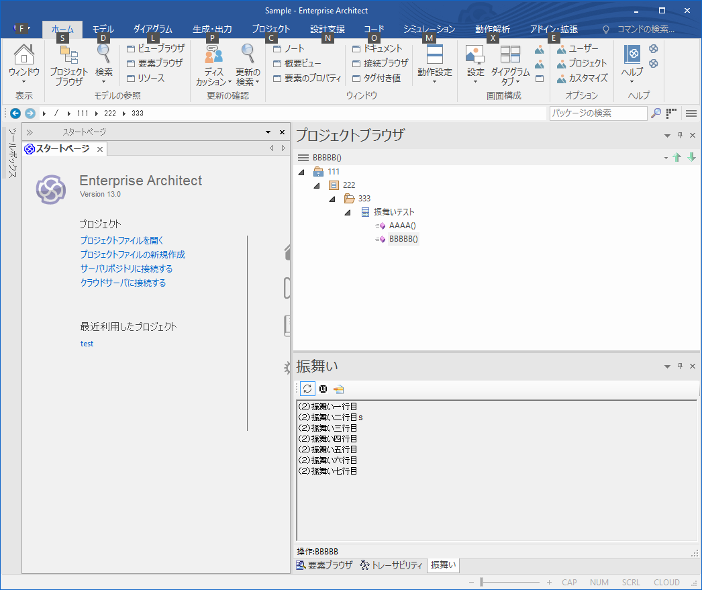
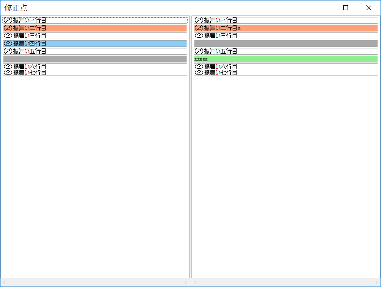

# ea_sample_subwindow

-----------------------------------------------------------------------------------

## 開発環境
* Window10
* Enterprise Architect 13.0
* Visual Studio Commutity 2015

## ビルド後イベントのコマンドライン
```
rem ■■ DLLコピー ■■
copy $(TargetFileName) "..\..\..\setup\$(TargetFileName)"
copy $(TargetFileName) "C:\Program Files (x86)\SparxSystems Japan\EA\$(TargetFileName)"

rem ■■ DLL登録 ■■
set DotNetReg="%SystemRoot%\Microsoft.NET\Framework\v4.0.30319"
%DotNetReg%\RegAsm.exe "C:\Program Files (x86)\SparxSystems Japan\EA\$(TargetFileName)"

rem ■■ レジストリ登録 ■■
set RegistoryPath="HKCU\Software\Sparx Systems\EAAddins\振舞い編集アドイン"
IF EXIST "%SystemRoot%\syswow64\reg.exe" (
 set RegExeFolder="%SystemRoot%\syswow64"
) ELSE (
 set RegExeFolder="%SystemRoot%\system32"
)
%RegExeFolder%\reg.exe add %RegistoryPath% /ve /f /d MethodBehavior.AddinMain
```

## 操作確認
1.[サブウィンドウ](http://www.sparxsystems.jp/help/13.0/custom_docked_window.htm)を表示
 アドイン・拡張｜アドイン｜ウィンドウ


2.保存する前に変更点を確認できます。
